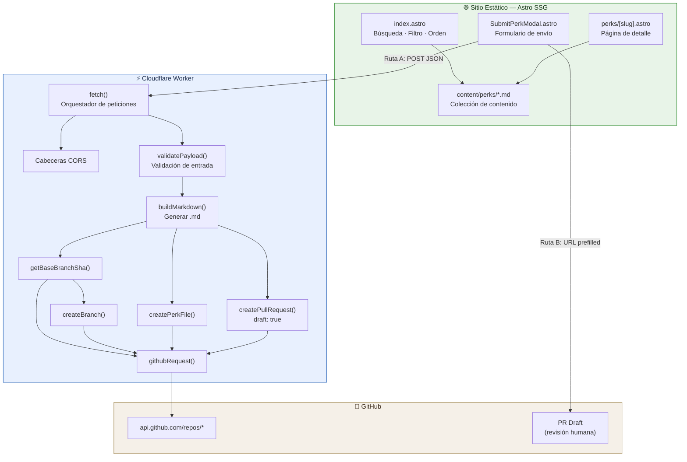

# Arquitectura — StartupPerks

## Resumen

StartupPerks es un directorio open-source de créditos, descuentos y beneficios para startups. Es un sitio estático con una API pública de envíos que crea PRs en GitHub como borrador.

| Propiedad | Valor |
|-----------|-------|
| Stack | Astro 5.17 + Bun |
| Renderizado | Estático (SSG) |
| Contenido | Archivos Markdown con frontmatter validado por Zod |
| API de envíos | Cloudflare Worker (TypeScript) |
| Hosting | Salida estática de Astro + Cloudflare Workers |

---

## Estructura de Directorios

```
astro-startup-perks/
├── src/
│   ├── content/
│   │   └── perks/              # Un archivo .md por beneficio de startup
│   ├── components/
│   │   ├── PerkCard.astro      # Tarjeta de listado de beneficio
│   │   ├── PlaceholderCard.astro # Esqueleto de carga
│   │   └── SubmitPerkModal.astro  # Formulario de envío + flujo API
│   ├── layouts/
│   │   └── BaseLayout.astro    # SEO, etiquetas OG, JSON-LD, ViewTransitions
│   ├── pages/
│   │   ├── index.astro         # Inicio: búsqueda, filtro, ordenamiento
│   │   ├── perks/[slug].astro  # Página de detalle (rutas dinámicas)
│   │   ├── contributing.astro  # Guía de contribución
│   │   └── faq.astro          # Preguntas frecuentes
│   ├── styles/
│   │   └── global.css
│   └── content.config.ts       # Esquema Zod para frontmatter de beneficios
├── workers/
│   └── submit-api/
│       ├── src/
│       │   └── index.ts        # Worker de la API de envíos (archivo único)
│       └── wrangler.toml       # Configuración del Worker de Cloudflare
├── package.json
├── astro.config.ts
└── tsconfig.json
```

---

## Capas de la Arquitectura

### 1. Capa de Contenido

**Ubicación:** `src/content/perks/*.md`  
**Esquema:** `src/content.config.ts` (Zod)

Cada beneficio es un archivo Markdown con frontmatter YAML. Estructura de ejemplo:

```yaml
company: "Stripe"
title: "$50,000 en Créditos de Stripe"
summary: "Programa oficial para startups de Stripe."
perkType: "credit"
amountDisplay: "$50,000"
currency: "USD"
eligibility: "Para startups en etapa Seed..."
fundingStages: ["Seed"]
regions: ["Global"]
categories: ["Payments"]
applyUrl: "https://stripe.com/startups"
sourceUrl: "https://stripe.com/startups"
lastVerified: 2026-07-01
verified: false
isActive: true
```

**Validación:** Todos los campos se validan en tiempo de build mediante `z.object()` con restricciones `.min()`, `.url()`, `.enum()`, `.coerce.date()`.

**Restricciones del esquema:**
- `company`: mínimo 2 caracteres
- `title`: mínimo 8 caracteres
- `summary`: mínimo 24 caracteres
- `perkType`: enum `credit | discount | trial | mixed`
- `amountDisplay`: mínimo 2 caracteres
- `currency`: exactamente 3 caracteres, por defecto `USD`
- `eligibility`: mínimo 12 caracteres
- `categories`: array no vacío, cada elemento mínimo 2 caracteres
- `applyUrl` / `sourceUrl`: URLs válidas
- `verified`: booleano, por defecto `false`
- `isActive`: booleano, por defecto `true`

---

### 2. Capa de Presentación (Astro SSG)

**Componentes:**
- `BaseLayout.astro` — Layout raíz: metadatos SEO, OpenGraph, Twitter Cards, datos estructurados JSON-LD, View Transitions, carga de fuentes
- `PerkCard.astro` — Componente de tarjeta para la grilla de inicio
- `PlaceholderCard.astro` — Esqueleto de carga
- `SubmitPerkModal.astro` — Modal con formulario de envío y lógica de doble ruta

**Páginas:**

| Ruta | Origen | Descripción |
|------|--------|-------------|
| `GET /` | `index.astro` | Inicio con búsqueda, filtro por categoría/etapa, ordenamiento |
| `GET /perks/{slug}` | `perks/[slug].astro` | Página de detalle (SSG desde colección de contenido) |
| `GET /contributing` | `contributing.astro` | Guía de contribución |
| `GET /faq` | `faq.astro` | Preguntas frecuentes |

**Flujo de la página de inicio (`index.astro`):**

```
init()
├── Cargar todos los beneficios vía getCollection("perks")
├── Filtrar: por categoría, etapa de financiamiento, texto de búsqueda
├── Ordenar: por nombre de empresa, valor, o más recientes
├── Renderizar: grilla de PerkCard
└── Adjuntar: SubmitPerkModal
```

---

### 3. API de Envíos (Cloudflare Worker)

**Endpoint:** `POST /api/submit-perk` (también sirve `/` y `/submit-perk`)  
**Archivo:** `workers/submit-api/src/index.ts` (342 líneas)

#### Variables de Entorno

| Variable | Requerida | Propósito |
|----------|-----------|-----------|
| `GITHUB_TOKEN` | Sí | PAT de GitHub para llamadas a la API |
| `GITHUB_REPO` | Sí | Repositorio objetivo (ej. `owner/repo`) |
| `GITHUB_BASE_BRANCH` | No | Rama base para el PR (por defecto: `main`) |
| `ALLOWED_ORIGIN` | No | Lista blanca de orígenes CORS |

#### Flujo de Petición

```
POST /api/submit-perk
  │
  ├─ 1. Preflight CORS (OPTIONS → 204)
  │
  ├─ 2. Verificación de ruta (isAllowedPath)
  │
  ├─ 3. Verificación de origen (si ALLOWED_ORIGIN está configurado)
  │
  ├─ 4. Verificación de método (solo POST)
  │
  ├─ 5. Verificación de token (GITHUB_TOKEN + GITHUB_REPO presentes)
  │
  ├─ 6. Parseo JSON (request.json())
  │
  ├─ 7. Validar payload
  │     ├── cleanText()      → recortar strings
  │     ├── normalizeStringArray() → aplanar o envolver arrays
  │     ├── isValidUrl()     → new URL() + verificación de protocolo
  │     └── Verificación honeypot → rechazar si el campo "website" tiene valor
  │
  ├─ 8. Construir nombre de rama
  │     ├── toSlug(company) → [a-z0-9-]+
  │     └── branchName = submission/{slug}-{timestamp36}
  │
  ├─ 9. Construir markdown
  │     ├── yamlString() → escapar \, ", \n
  │     └── buildMarkdown() → frontmatter YAML + cuerpo
  │
  ├─ 10. Creación de PR en GitHub
  │      ├── getBaseBranchSha()   → GET /git/ref/heads/{branch}
  │      ├── createBranch()        → POST /git/refs
  │      ├── createPerkFile()      → PUT /contents/{path} (base64)
  │      └── createPullRequest()   → POST /pulls (draft: true)
  │
  └─ 11. Retornar { ok: true, prUrl }
```

#### Comunicación con la API de GitHub

Todas las llamadas a GitHub pasan por `githubRequest()` que:
- Agrega `Authorization: Bearer {GITHUB_TOKEN}`
- Establece `Accept: application/vnd.github+json`
- Establece `User-Agent: startup-perks-submit-api`
- Pasa por `parseGithubResponse()` para manejo de errores

---

### 4. Rutas de Envío (Estrategia Dual)

El modal de envío soporta dos caminos:

#### Ruta A: API Directa (producción)

1. Usuario llena el formulario en `SubmitPerkModal`
2. Datos del formulario serializados como JSON
3. `POST` a `submissionApiUrl` (Cloudflare Worker)
4. Worker valida → crea PR borrador en GitHub
5. Retorna `{ ok: true, prUrl }`
6. Cliente abre la URL del PR en nueva pestaña

#### Ruta B: Flujo Web de GitHub (respaldo)

1. Usuario llena el formulario
2. Cliente construye markdown vía `createMarkdown()`
3. Construye URL de GitHub: `https://github.com/{repo}/new/{branch}/src/content/perks?filename=...&value=...`
4. Abre página de creación de archivo pre-rellenada de GitHub en nueva pestaña
5. Usuario envía el PR manualmente a través de la UI de GitHub

**Lógica de selección:** Si `submissionApiUrl` está configurado → Ruta A. De lo contrario → Ruta B.

---

## Diagrama de Flujo de Datos



---

## Modelo de Seguridad

| Preocupación | Mitigación |
|--------------|-----------|
| Envíos spam | Campo honeypot (`website`), PRs creados como borrador |
| Path traversal | `toSlug()` restringe a `[a-z0-9-]+` |
| Inyección de URL | `isValidUrl()` valida protocolo (solo http/https) |
| Inyección YAML | `yamlString()` escapa `\`, `"`, saltos de línea |
| XSS (cliente) | Usa `textContent`, no `innerHTML` |
| Exposición de secretos | Token en variables de entorno de Cloudflare, no en código fuente |
| CSRF | Verificación CORS `ALLOWED_ORIGIN` (cuando está configurado) |
| Rate limiting | No implementado (ver INFORME_SEGURIDAD.md) |

---

## Estructura de Comunidades (Análisis Gortex)

El código se auto-particiona en estas áreas funcionales:

| Comunidad | Hub | Tamaño | Propósito |
|-----------|-----|--------|-----------|
| submit-api/src · fetch | `fetch` | 30 símbolos | Orquestación de peticiones, CORS, manejo de respuestas |
| submit-api/src · githubRequest | `githubRequest` | 30 símbolos | Capa de comunicación con API de GitHub |
| submit-api/src · validatePayload | `validatePayload` | 19 símbolos | Sanitización y validación de entrada |
| submit-api/src · getBaseBranchSha | `getBaseBranchSha` | 15 símbolos | Operaciones de ramas/refs de GitHub |
| components | `setupModal` | 9 símbolos | UI del modal y lógica de envío de formulario |

---

## Decisiones Clave de Diseño

1. **Contenido primero:** Los beneficios son archivos Markdown planos. El sitio es un visor, no un CMS.
2. **Ruta de envío dual:** API directa cuando está disponible, flujo web de GitHub como respaldo — no requiere backend para instancias auto-hospedadas.
3. **PRs como borrador:** Todos los envíos automatizados crean PRs borrador. Se requiere revisión humana antes del merge.
4. **Escapado YAML doble:** Tanto el cliente (`SubmitPerkModal`) como el servidor (`buildMarkdown`) escapan valores YAML independientemente — defensa en profundidad.
5. **Sin autenticación en API de envíos:** Pública por diseño ya que los PRs son borradores y requieren revisión humana.
6. **Esquema Zod:** Validación de contenido en tiempo de build mediante colecciones de Astro. El mismo esquema se aplica en la validación del worker.

---

## Superficie de Configuración

| Config | Cómo | Por defecto |
|--------|------|-------------|
| Esquema de beneficios | `src/content.config.ts` (Zod) | — |
| Configuración de Astro | `astro.config.ts` | — |
| Variables de entorno del Worker | Cloudflare Dashboard / `wrangler secret` | — |
| Config del Worker | `workers/submit-api/wrangler.toml` | — |
| URL de API de envíos | Prop del frontend `submissionApiUrl` | Vacío (usa flujo GitHub) |
| URL del repositorio | Prop del frontend `repositoryUrl` | Vacío |
| Rama base | Prop del frontend `baseBranch` | `main` |
